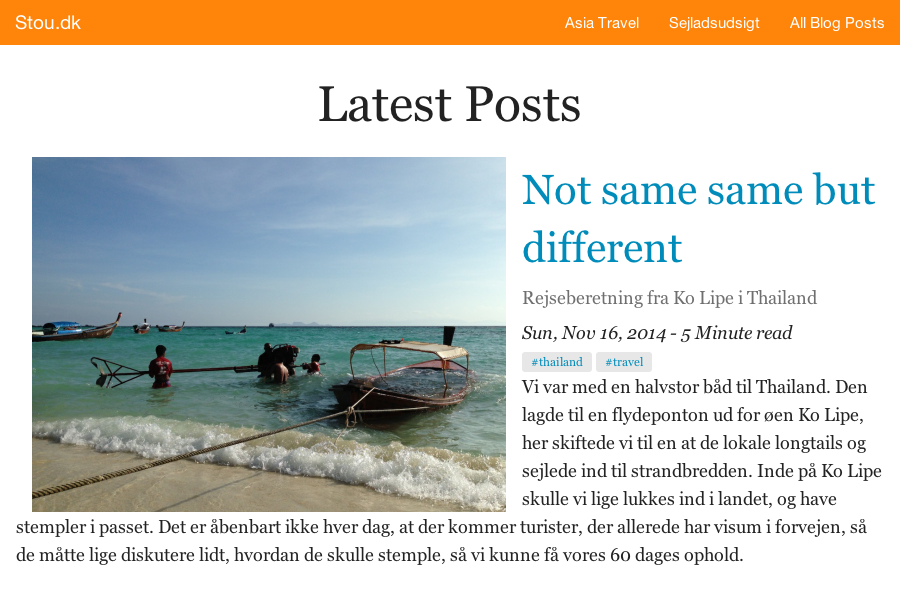

# Mobile First Blog Theme for Hugo 

It was created for my personal blog at [stou.dk](http://stou.dk)

## Example

You can see an [example of the theme in action](http://stou.dk).


## Requirements

The theme is built using Zurb Foundation with sass / compass.
Thus, there are a few requirements to get started.

  * Ruby 1.9+
  * [Node.js](http://nodejs.org)
  * [compass](http://compass-style.org/): `gem install compass`
  * [bower](http://bower.io): `npm install bower -g`


## How to Use the Theme

Once you have the requirements installed, you can use or modify the theme like this

  * Clone this repo in the themes folder of your Hugo site
  * `cd themes/stou-dk-theme`
  * Run `bower install` to install the latest version of Foundation
  * `bundle exec compass watch`

Leave the last command running and run the hugo server in a different terminal.
This will allow you to see the updates to you style changes using hugo's liveupdate.

__NB!__ Compass only needs to run once to generate the styles. If you are satisfied with the generated css, simply run the hugo server when editing site content.

## Upgrading

If you'd like to upgrade to a newer version of Foundation down the road just run:

```bash
bower update
```

in the `themes/stou-dk-theme` folder.

## Screenshots



Here are [a few more screenshots](images/).

## License
Open sourced under the MIT license.

